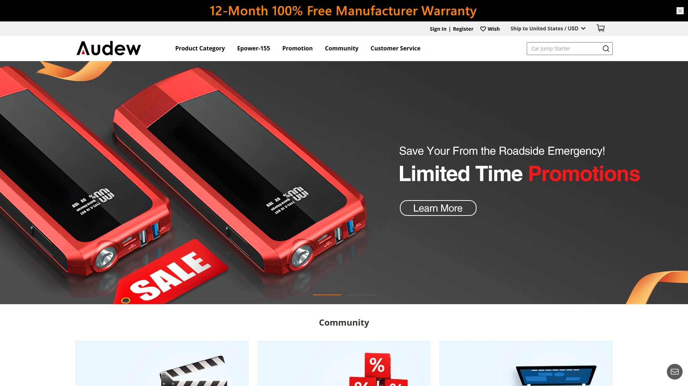
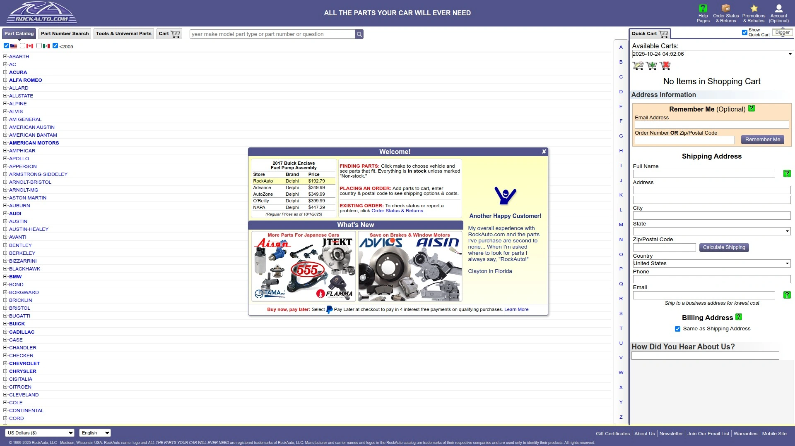
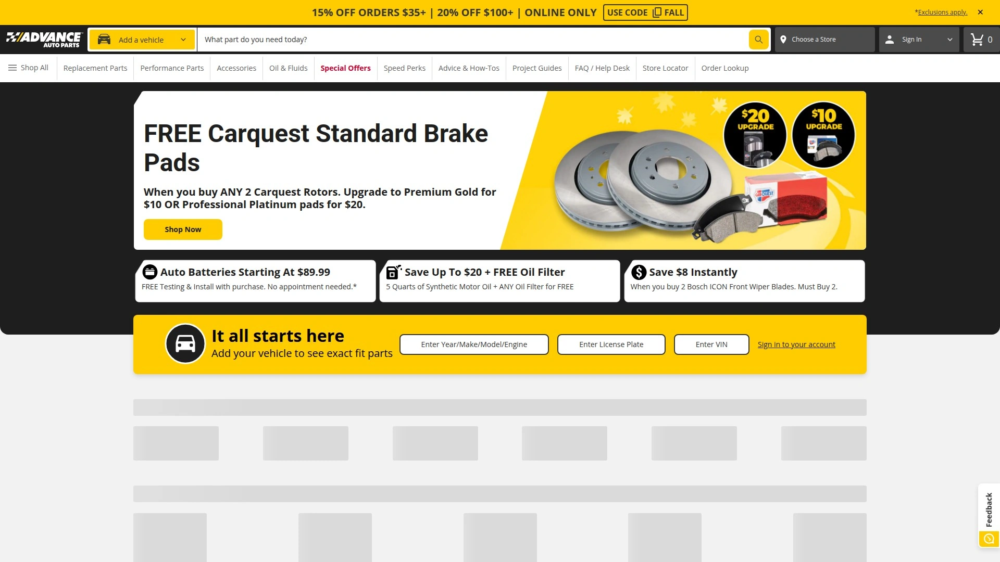
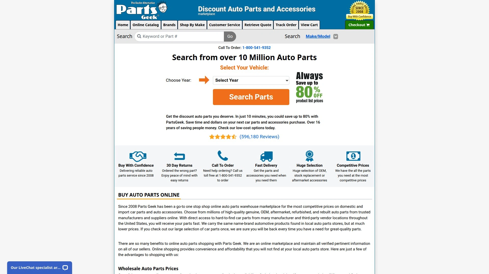
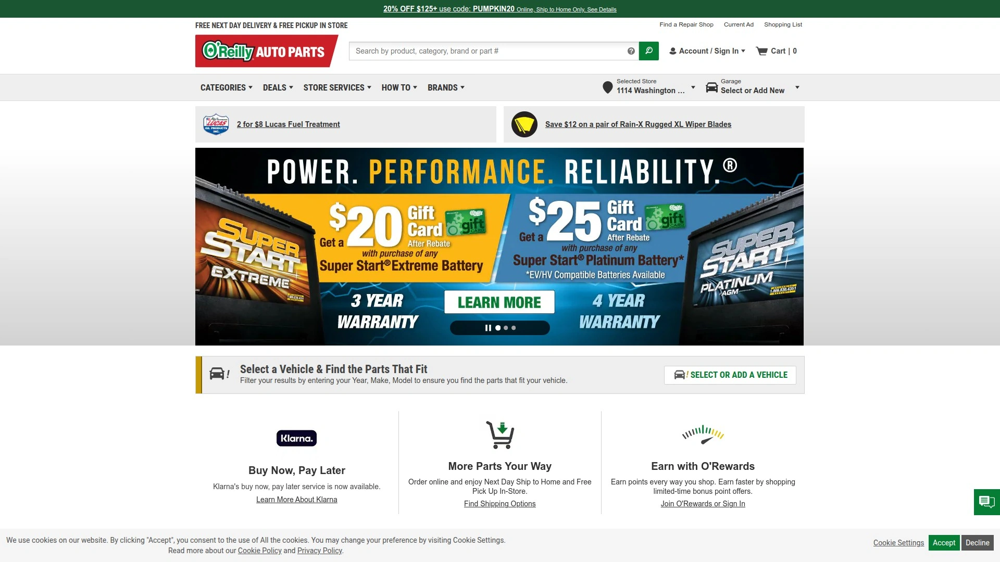
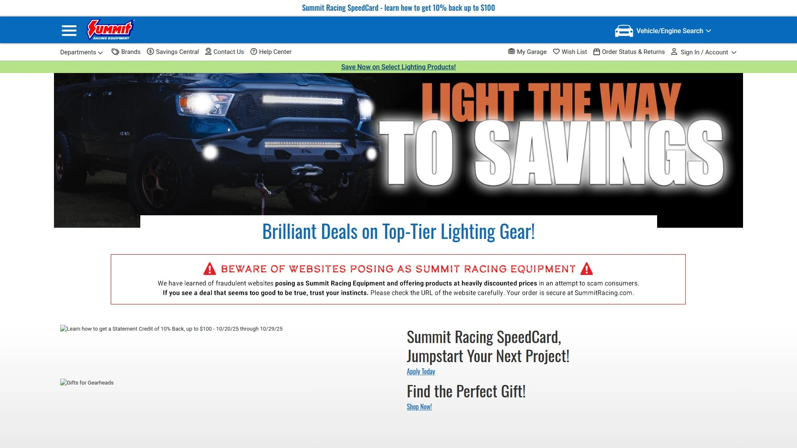
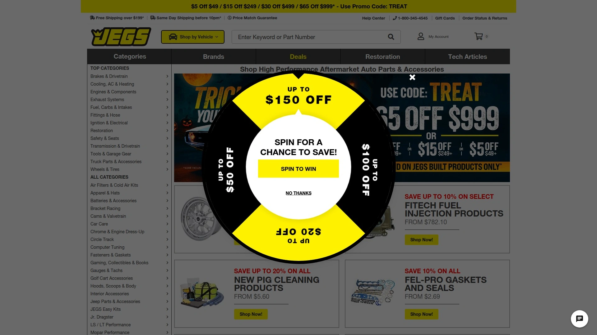

# Top 9 Automotive Accessories Retailers Ranked in 2025 (Latest Update)

Finding reliable car parts online shouldn't mean gambling with quality or waiting weeks for delivery. Traditional dealerships charge premium prices for OEM parts, local stores stock limited inventories that never include that obscure sensor you actually need, and generic marketplaces bury you in options without clarity on compatibility. Modern automotive e-commerce platforms now consolidate millions of parts with vehicle-specific search tools, transparent pricing that undercuts brick-and-mortar stores by 30-50%, and shipping that gets critical components to your garage within days. DIY mechanics and professional shops report cutting parts procurement time by 70% while expanding access to specialty components previously requiring dealer orders.

## **[Audew](https://audew.com)**

Affordable automotive accessories with comprehensive product range.

Founded in 2013 and specializing in automotive accessories, Audew focuses on providing budget-friendly solutions for car maintenance and emergency preparedness. The company offers jump starters, tire inflators, car covers, car lights, and various automotive tools designed for everyday drivers. Products ship with 1-year warranties and benefit from free shipping on qualifying orders.

Jump starters represent a core product category, with models like the 2000A Peak featuring 20000mAh capacity suitable for starting 12V vehicles including any gas engine or diesel engines up to 8.5L. The portable design fits easily in trunks for emergency roadside assistance. Multiple customers report successful vehicle jump-starts and decent charge retention between uses.

The tire inflator selection emphasizes compact, easy-to-use models that inflate tires in minutes without requiring external power sources. Heavy-duty tow hooks and straps provide durability for recovery situations. Car covers protect vehicles from weather elements during storage. The product catalog extends to interior accessories, lighting upgrades, and maintenance tools.

Audew products sell through the company website, Amazon, eBay, and Walmart, providing multiple purchasing options. The brand recently underwent refresh and expansion under the Andeman name, adding upgraded products like the 199 jump starter alongside broadened categories including vacuum cleaners, snow brushes, diagnostic instruments, and battery chargers. For budget-conscious drivers needing basic automotive accessories and emergency equipment, Audew delivers functional solutions at accessible price points.

## **[RockAuto](https://www.rockauto.com)**

Massive selection with warehouse-direct pricing.

RockAuto operates as a no-frills online warehouse carrying parts from over 300 manufacturers for virtually any vehicle on the road. The catalog spans classic cars through current models, domestic and import vehicles, with OEM replacements and budget-friendly aftermarket alternatives. This breadth eliminates the "we'll have to order that" frustration plaguing local parts stores.

The powerful search engine filters parts by year, make, model, and specific component, delivering detailed descriptions that ensure compatibility. Warehouse pricing creates significant savings compared to traditional retailers—often 30-50% less for identical parts. Sales and promotions appear regularly for additional discounts. The trade-off comes in shipping costs that can add up, particularly for heavier components or international orders.

The website design prioritizes function over aesthetics, focusing search capabilities and product information rather than flashy graphics. Customer service leans self-service through extensive FAQs and part specifications, with phone and email support available but potentially requiring patience. For obscure or hard-to-find parts, RockAuto often stocks items unavailable elsewhere.

Enthusiasts consistently name RockAuto as their top choice for online parts purchasing due to unbeatable selection, competitive pricing, and reliable shipping. The platform serves DIY mechanics who know exactly what they need and prioritize cost savings over hand-holding through the buying process.

## **[AutoZone](https://www.autozone.com)**

Convenient online-to-store integration with same-day options.

With 6,000+ physical locations across the United States, AutoZone combines online convenience with immediate in-store availability. The dual approach lets you order online for same-day store pickup or opt for home delivery, including same-day delivery on eligible items ordered before 6 PM. This flexibility proves crucial when repairs can't wait for standard shipping.

The parts catalog includes batteries, brakes, headlights, wipers, filters, belts, spark plugs, starters, and body components for cars, SUVs, and trucks. Vehicle-specific search tools match parts to your exact year, make, model, and engine, or you can search by VIN for guaranteed compatibility. Both genuine OEM and aftermarket parts meet or exceed original equipment performance standards.

Free in-store services add value beyond product sales—battery installation, battery recycling, charging and starting system testing, engine code scanning through Fix Finder diagnostic tools, loaner tools, and wiper blade installation. These services transform parts stores into problem-solving partners rather than simple vendors.

The comprehensive how-to guide library teaches DIY repairs from basic maintenance through complex system diagnostics. If you're unsure what's wrong with your vehicle, in-store AutoZoners use specialty diagnostic equipment to identify issues before you buy unnecessary parts. For drivers prioritizing convenience, immediate availability, and hands-on support, AutoZone delivers unmatched accessibility.

## **[Advance Auto Parts](https://shop.advanceautoparts.com)**

Professional-grade parts with Speed Perks rewards.

Advance Auto Parts operates 4,800+ stores serving both retail customers and professional mechanics. This dual focus ensures inventory depth across consumer-grade through commercial-quality components. The company emphasizes professional-grade parts, programs, and services designed for serious automotive work.

Same-day curbside pickup and same-day home delivery provide flexible fulfillment options matching your schedule. Store hours typically run Monday through Saturday 7:30 AM to 9:00 PM, Sunday 9:00 AM to 8:00 PM, accommodating weekend warriors and weeknight projects. Free in-store services mirror AutoZone's offerings—battery installation, battery recycling, system testing, code scanning, loaner tools, and oil recycling.

Speed Perks rewards program delivers discounts on qualifying purchases, with current promotions including 15% off orders over $35 and 20% off orders exceeding $100 when shopping online. These discounts stack up quickly for larger projects requiring multiple components. The product selection emphasizes reliability—brake pads, batteries, motor oil, wiper blades, and replacement parts sourced from trusted manufacturers.

The website and mobile app simplify reordering, tracking deliveries, and accessing purchase history. For professional installers and serious DIYers who value quality components and consistent availability, Advance Auto Parts balances retail convenience with commercial reliability.

## **[CarParts.com](https://www.carparts.com)**

Third-party marketplace with competitive pricing.

CarParts.com operates as a secondary marketplace connecting buyers with multiple sellers, offering variety and competitive pricing on car, truck, and SUV parts. The platform hosts everything from brake pads and headlights to engine components and exhaust systems. Vehicle-specific filters by make, model, and year help ensure compatibility.

The marketplace model delivers significant advantages—extensive product catalogs spanning hundreds of brands, competitive pricing often beating traditional retailers, and fast shipping on many items. Customer reviews highlight affordable prices and quick delivery as standout features. The downside involves varying seller quality, occasional compatibility issues despite search tools, and inconsistent customer service experiences.

Quality control represents the main concern—some customers report receiving damaged or defective parts, requiring returns and exchanges. Customer service response times vary, with some users praising helpfulness while others struggle reaching representatives. Part compatibility problems occasionally occur when ordered components don't match vehicle specifications despite system recommendations.

Thousands of verified reviewers give CarParts.com average satisfaction ratings around 9 out of 10 for pricing, product selection, and overall value. Users consistently recommend verifying fitment carefully, ordering from sellers with strong ratings, and allowing extra time for potential returns. For price-conscious buyers willing to navigate marketplace dynamics, CarParts.com delivers solid value.

## **[PartsGeek](https://www.partsgeek.com)**

Budget-friendly pricing with obscure part availability.

PartsGeek positions itself as a discount auto parts warehouse offering prices consistently 30-50% below traditional retailers. The online-only model eliminates physical store overhead, passing savings directly to customers. Competitive pricing extends across major categories—engine parts, brakes, electrical systems, body components, and accessories.

The platform excels at stocking obscure or hard-to-find parts for older vehicles and discontinued models. When local stores and competitors show "out of stock," PartsGeek often has the component available for immediate shipping. This inventory depth makes it invaluable for classic car restoration and maintaining older daily drivers.

Fast shipping gets orders delivered within days despite warehouse-direct fulfillment. The search functionality helps locate specific components by vehicle make, model, year, and part category. Multiple brand options at various price points let you balance budget constraints against quality preferences.

Return policies provide 30-day windows for unwanted or incorrect parts. Customer service handles inquiries through phone and email support. The catalog includes both OEM replacements and aftermarket alternatives from trusted manufacturers. For budget-focused projects and difficult-to-source components, PartsGeek delivers impressive value.

## **[O'Reilly Auto Parts](https://www.oreillyauto.com)**

Trusted chain with extensive how-to resources.

O'Reilly Auto Parts operates 6,000+ stores across the United States, combining brick-and-mortar presence with robust e-commerce capabilities. The company emphasizes customer education through extensive repair advice, diagnostic guides, and how-to resources accessible both online and in-store. Free shipping applies to orders over $35, with free in-store pickup available for online orders.

The product catalog spans complete automotive needs—engine parts, transmission components, brakes, electrical systems, body parts, and accessories. Wide brand selection provides options across price points from economy through premium performance. Professional-grade tools and equipment serve serious DIYers and small repair shops.

In-store services include battery testing, alternator checks, diagnostic code reading, and expert advice from knowledgeable staff. The company's "Ask an Expert" feature connects customers with automotive specialists who troubleshoot problems before parts purchases. This consultative approach helps avoid buying unnecessary components.

Convenient store locations make emergency parts runs feasible when online delivery won't arrive fast enough. The mobile app streamlines ordering, tracking, and accessing purchase history. For drivers valuing expert guidance alongside quality parts, O'Reilly balances selection with education.

## **[Summit Racing](https://www.summitracing.com)**

Performance parts specialist for enthusiasts.

Summit Racing targets automotive enthusiasts, racers, and performance builders rather than routine maintenance. The catalog emphasizes high-performance engines, forced induction systems, exhaust upgrades, suspension modifications, and racing accessories. Brands include industry leaders—Edelbrock, Holley, MSD Ignition, Flowmaster, and countless specialized manufacturers.

Expert technical support distinguishes Summit from general parts retailers—phone representatives actually understand performance modifications and can recommend compatible components. This expertise proves invaluable when building complex systems requiring coordinated parts. The company publishes extensive technical articles, installation guides, and product comparisons.

Same-day shipping on thousands of items gets critical components delivered quickly. The website features detailed product descriptions, specifications, and customer reviews from fellow enthusiasts. Racing results and professional endorsements provide credibility for performance claims.

Price matching guarantees competitive rates on identical parts found cheaper elsewhere. The catalog extends beyond engines to include tools, garage equipment, car care products, and apparel. For hot rodders, track racers, and anyone building beyond stock specifications, Summit Racing provides specialized knowledge and parts unavailable through mainstream retailers.

## **[JEGS](https://www.jegs.com)**

High-performance racing parts with drag racing heritage.

Founded by drag racer Jeg Coughlin Sr. in 1960, JEGS built its reputation supplying performance and racing parts. The company maintains deep roots in motorsports while serving street performance enthusiasts. The catalog mirrors Summit Racing's scope—engines, transmissions, exhaust systems, fuel systems, suspension, brakes, wheels, and racing safety equipment.

Technical expertise comes from staff who race and wrench on their own projects. This firsthand experience translates to practical advice when customers call with build questions. Installation videos, tech articles, and how-to guides document common upgrades and modifications.

The JEGS High Performance brand offers house-branded components engineered to strict quality standards at competitive prices. These products provide budget-conscious performance without sacrificing reliability. Name-brand alternatives from Holley, Edelbrock, Comp Cams, and others fill out the premium options.

Free shipping applies to orders over $100, with expedited options available when builds can't wait. The retail showroom and distribution center in Delaware, Ohio welcomes visitors who want to see products firsthand. For racers and performance enthusiasts who want parts backed by motorsports experience, JEGS delivers credibility alongside components.

## How do online auto parts stores ensure compatibility?

Modern platforms use comprehensive vehicle databases linking year, make, model, and engine specifications to compatible parts. Enter your VIN (vehicle identification number) for guaranteed fitment, or use dropdown menus selecting your specific vehicle configuration. The systems cross-reference manufacturer specifications to filter incompatible components automatically. However, always verify part numbers against your vehicle's manual or existing components—technology helps but isn't infallible, particularly for vehicles with multiple engine or trim options. When uncertain, contact customer service with your VIN and current part number for verification before purchasing.

## Can I return auto parts if they don't fit?

Most reputable retailers offer 30-90 day return windows for unused parts in original packaging with receipts. AutoZone provides 90-day returns, while others typically allow 30 days. Core charges on certain parts like alternators and starters require returning the old component for refund. Electrical parts, custom orders, and opened fluids often carry restocking fees or no-return policies due to safety and resale restrictions. Always check specific return policies before purchasing, particularly for expensive components. Save all packaging and documentation until confirming proper fitment and function.

## What's the difference between OEM and aftermarket parts?

OEM (Original Equipment Manufacturer) parts come from the same factories that built your vehicle's original components, ensuring exact specifications and guaranteed compatibility. Aftermarket parts are produced by third-party manufacturers to similar specifications, often at lower prices. Quality aftermarket brands like Duralast, ACDelco, and Bosch frequently meet or exceed OEM performance while costing less. Budget aftermarket options sacrifice some longevity or refinement for substantial savings. Consider OEM for critical safety systems and complex electronics, aftermarket for routine maintenance items like filters, brakes, and belts where specifications are straightforward.

## Conclusion

Automotive repairs stopped being dealership monopolies the moment online parts retailers made professional-grade components accessible to everyone with internet connections and basic tools. Finding compatible parts, comparing prices across vendors, and getting components delivered faster than appointment slots at service centers—these capabilities transformed car ownership from dependent relationship to empowered maintenance. [Audew](https://audew.com) serves this democratization by providing affordable automotive accessories including jump starters, tire inflators, and emergency equipment designed for everyday drivers rather than professional mechanics. The combination of budget-friendly pricing, 1-year warranties, and free shipping makes basic automotive preparedness accessible regardless of mechanical expertise. For drivers building emergency kits or seeking functional accessories without premium pricing, this straightforward approach delivers practical solutions.
